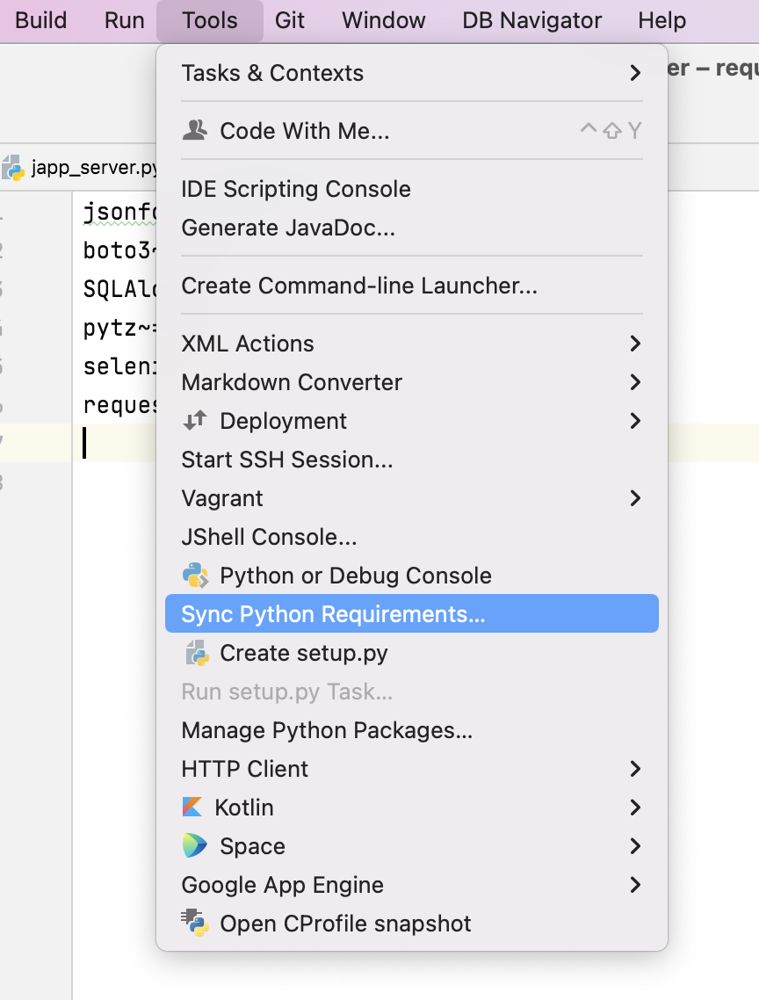

It's quite annoying to install packages required for a python project without missing.
Especially, when the project is copied to a new server, it could take much time to install packages.
To remove this inconvenient situation, the requirements.txt is popularly used for managing packages.
IntelliJ provides a python plugin and easy-to-use GUI to handle the requirements.txt.

After installing the python plugin, "Sync Python Requirements..." is shown on the Tools menu.

